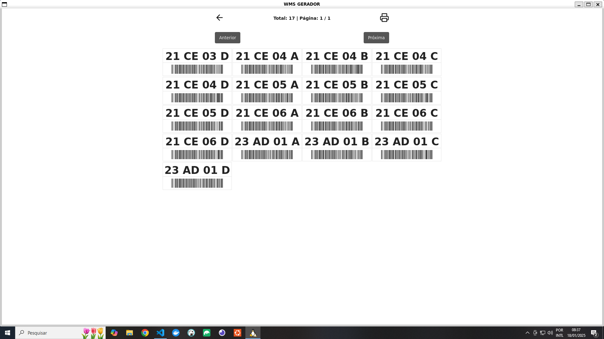

[](https://twitter.com/t_h_e_u)
[](https://www.linkedin.com/in/matheusgbatista/)
[](https://t-heu.github.io)

## About (WMS Labeler)

WMS Labeler é uma aplicação web desenvolvida para simplificar e otimizar o processo de geração de etiquetas WMS (Warehouse Management System). Criada com tecnologias modernas, a ferramenta oferece uma solução rápida, eficiente e intuitiva, eliminando a necessidade de softwares legados como Excel VBA e Windows XP, enquanto melhora significativamente a produtividade em ambientes logísticos.

_OBS.: Esse sistema foi adaptado para uma empresa em específico._

## 🚀 Tecnologias

Este projeto foi desenvolvido utilizando as seguintes tecnologias:

- [Next.js](https://nextjs.org/docs): Framework React para desenvolvimento de aplicações web.
- [XLSX](https://sheetjs.com/): Biblioteca para manipulação de arquivos Excel (leitura e escrita).

## 📦 Instalação e Configuração

1. Clone este repositório.
2. Instale as dependências:
   ```bash
   npm install
   # ou
   yarn
   ```
3. Inicie o servidor de desenvolvimento:
   ```bash
   npm run start
   # ou
   yarn start
   ```

## 📝 Funcionalidades

- [Next.js](https://nextjs.org/docs): Utilizado para criar o front-end da aplicação.
- [XLSX](sheetjs.com/): Processamento de arquivos Excel, como importação e exportação de dados.

## 🖼️ Preview



## 🛠️ Como Usar

- **Importar um arquivo Excel**:
  1. Clique no botão "Escolher Arquivo".
  2. Selecione o arquivo Excel.
  3. Clique no botão "Gerar".
  4. Aguarde o processamento dos dados e depois gere PDF.

## 🐛 Problemas e Suporte

Caso encontre algum problema, sinta-se à vontade para abrir uma [issue](https://github.com/t-heu/seu-repositorio/issues).

## 📄 Licença

Este projeto está sob a licença MIT. Veja o arquivo [LICENSE](LICENSE) para mais detalhes.

## OBS.:

```
Caso tamanho "size: 76.2mm 50.8mm;" não de certo tentar:
C7 (81 mm x 114 mm)
B8 (62 mm x 88 mm)
Cartão de Visita (85 mm x 55 mm (ISO 7810 ID-1))
```
